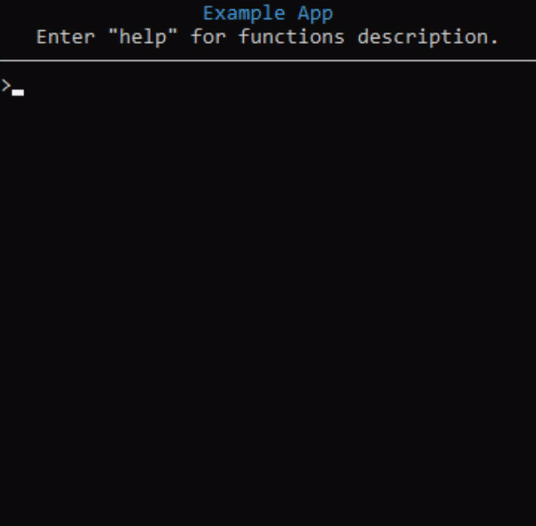

# console_app
## Description
It is package that implements simple console interface for small programs.
Working at Windows.
## Used modules
- [colorama](https://github.com/tartley/colorama)
## Usage example
```
from console_app import ConsoleApp, Method

def hello():
    print("Hello World!")

def counter(args):
    for i in range(int(args[0])):
        print(i + 1, end=" ")
    print()

app = ConsoleApp(
    title = "Example App",
    hello = Method("says hello", hello),
    count = Method("counts to number", counter, inline=True)
)
app.run()
```

